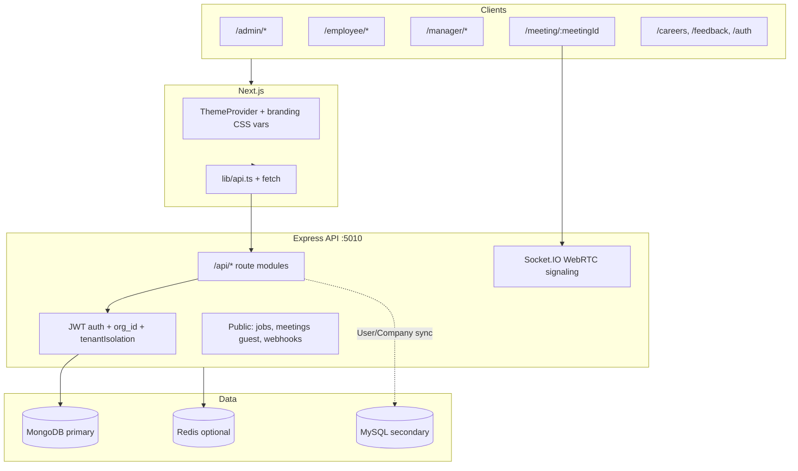
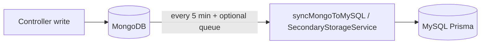
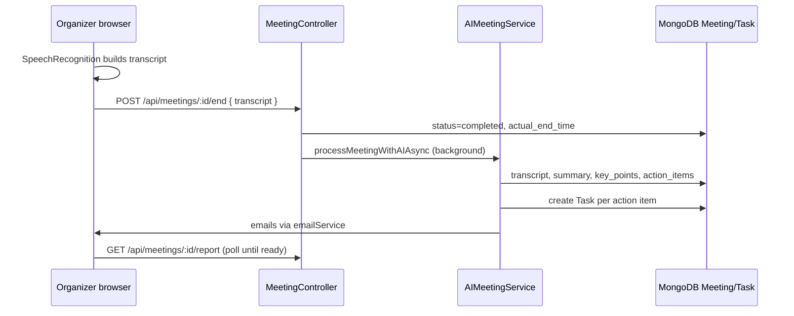

# EmployeeHR Repository Understanding (2026 refresh)

This document explains how the application works end-to-end: **Next.js frontend → Express API → MongoDB (primary) + MySQL/Prisma (secondary)**, with deep dives on **Meetings** (transcript-based AI) and **Stock / dispatch / invoices**.

It supersedes earlier notes where the product was described as HR-only. The codebase is now a **multi-tenant HR + inventory/accounts + recruitment** platform.

---

## 1) What this product is

**Elevate / EmployeeHR** is a multi-tenant SaaS-style platform where each **company** (`org_id`) gets:

| Area | What it does |
|------|----------------|
| **HR core** | Users, leave, payroll, attendance, contracts, tasks, messages, PDPs, KPIs, performance, awards, polls, alerts |
| **Recruitment** | Jobs, application forms, applicants, communications, analytics |
| **Meetings** | Schedule video/audio meetings, WebRTC rooms, guest links, **live transcript → AI summary → tasks → email** |
| **360° feedback** | Anonymous pools, surveys, public token links |
| **Inventory / ERP** | Products, quotations, invoices, dispatch, credit notes, clients, bulk SMS, M-Pesa payments, eTIMS hooks, analytics |
| **Accounts** | Client CRM, complaints, debts, expenses, payments, posts |
| **Platform** | Company branding, section-based page access, branches, owner super-admin, onboarding wizard |

**Removed:** The `app/shule` school module and `shule` backend routes have been deleted from the tree.

---

## 2) Tech stack

### Frontend (`/`)

- **Next.js 15** App Router (`app/`), React 18
- **UI:** Radix UI, Tailwind, `next-themes`, Framer Motion
- **API:** `lib/api.ts` (central client for most HR modules) + direct `fetch()` for stock and some admin pages
- **Realtime:** `socket.io-client` + `hooks/use-webrtc.ts` for meetings
- **Branding:** `components/theme-provider.tsx` loads `/api/company/branding` into CSS variables

### Backend (`server/`)

- **Express** on Node, default port **5010** (README still mentions 5000 in places)
- **MongoDB + Mongoose** — primary application data (~66 models)
- **MySQL + Prisma** — secondary layer (User/Company sync, audit; slim 5-table schema in `server/prisma/schema.prisma`)
- **Redis + BullMQ** — optional queue `mongo-to-mysql-sync` for User/Company sync
- **Socket.IO** — WebRTC signaling (`server/src/services/webrtcSignaling.ts`)
- **OpenAI** — meeting analysis (`AIMeetingService`, `AIAnalysisService`)
- **Multer** — uploads under `server/uploads/`
- **Nodemailer** — per-tenant email via `CompanyEmailController`

### API base URL (`lib/apiBase.ts`)

| Environment | URL |
|-------------|-----|
| Localhost | `http://localhost:5010` |
| Production (`*.codewithseth.co.ke`, Vercel) | `https://backend.codewithseth.co.ke` |
| Override | `NEXT_PUBLIC_API_URL` |

---

## 3) High-level architecture

---

## 4) Multi-tenant auth and isolation

### JWT flow

1. Login via `/api/auth/login`, company slug login, or employee ID login.
2. Backend issues JWT (`server/src/config/auth.ts`).
3. `authMiddleware` sets `req.user` and **`req.org_id`** from token payload.
4. Guest meeting users use `guest_*` IDs — **rejected** by `authMiddleware` (valid MongoDB ObjectId required).

### Roles (`lib/auth.ts`)

| Role | Primary UI |
|------|------------|
| `company_admin`, `admin`, `hr` | `/admin` |
| `manager` | `/manager` |
| `employee` | `/employee` |

`roleMiddleware` treats legacy `admin` as `company_admin`.

### Tenant isolation

- Controllers scope queries with **`org_id`** from `req.org_id`.
- `tenantIsolation.middleware.ts` reinforces org context and audit logging.

### Dynamic branding (per tenant)

- **Storage:** `Company` model — colors, logo, fonts, button style, location.
- **API:** `GET/POST /api/company/branding` (logo via multipart).
- **Frontend:** `ThemeProvider` sets CSS variables (`--brand-primary`, `--company-logo-url`, etc.).
- **Meeting reports / emails:** UI uses brand vars; emails still use mixed templates (some hardcoded gradients in `AIAnalysisService.generateSummaryEmail`).

### Section-based page access

Admin and employee layouts call **`GET /api/company/page-access`** and hide nav sections (CORE, RECRUITMENT, EMPLOYEE MANAGEMENT, INVENTORY MANAGER, ACCOUNTS, PERFORMANCE, SYSTEM). Managers use `lib/manager-access.ts`.

### Platform owner

- **`/owner`** — super-admin for all companies (email allowlist).
- **API:** `/api/owner/companies/*` — freeze/unfreeze, page toggles.

---

## 5) Dual storage: MongoDB + MySQL

### MongoDB (source of truth)

- All feature writes go to Mongoose models in `server/src/models/` (**66 models** across HR, stock, feedback, meetings, complaints, branches, etc.).

### MySQL (secondary)

- **Canonical Prisma schema:** `server/prisma/schema.prisma` — **5 models:** `User`, `Company`, `AuditLog`, `Session`, `AnalyticsSnapshot`.
- **Boot:** `index.ts` runs `runMigrations()` then starts server and **`startSyncScheduler()`** (every 5 minutes: migrations + bulk User/Company sync from Mongo).
- **Queue:** `syncWorker.ts` (BullMQ) can sync User/Company on job types — **queue helpers are not widely wired from controllers yet**.
- **Drift warning:** `server/src/generated/prisma/schema.prisma` still lists ~27 models; `WHATS_IN_MYSQL_NOW.md` may describe bulk-imported data that does not match the slim live schema. Treat MySQL reconciliation as an ops concern.

---

## 6) Frontend routing (143 pages)

### Layout guards

| Path | Guard |
|------|--------|
| `/admin/*` | Login + admin role + onboarding complete + section access |
| `/employee/*` | Login + employee (others redirected) + section access |
| `/manager/*` | Login + manager + manager sections |
| `/dashboard/*` | **No auth layout** (legacy HR UI; still linked from some meeting exits) |
| `/meeting/:meetingId` | Public guest form or authenticated join |
| `/feedback/*`, `/careers/*` | Public |
| `/owner` | Owner email check |

### Major admin sections (examples)

- **Stock:** `/admin/stock/*` — inventory, invoices, dispatch, quotations, credit notes, analytics (uses **direct** `/api/stock/...` fetch, not `lib/api.ts`).
- **Accounts:** `/admin/accounts/*` — clients, complaints, debts, expenses, payments, bulk SMS.
- **Meetings:** `/admin/meetings` — list + `MeetingInterface` (non-WebRTC) or links to `/meeting/:id` for WebRTC.
- **Feedback 360:** `/admin/feedback-360/*` — surveys, pools, responses.
- **Settings:** branding, branches, invoice generation, page access, email config, stamps.

### Employee highlights

- `/employee/meetings`, `/employee/dispatch`, `/employee/stock`, PDP, reports, payroll, etc.

---

## 7) Backend API catalog (by domain)

Mount paths from `server/src/index.ts`. Most routers use `authMiddleware` + `orgMiddleware` + `tenantIsolation` unless noted.

### Public / webhooks (no JWT)

| Method | Path | Purpose |
|--------|------|---------|
| GET | `/api/jobs/public/:companyName/:positionIndex` | Public job board |
| GET | `/api/application-forms/job/:jobId` | Application form |
| GET/POST | `/api/meetings/by-meeting-id/:meetingId` (+ `/join`) | Guest meeting access |
| POST | `/api/sms/dlr` | SMS delivery reports |
| POST | `/api/mpesa/callback` | M-Pesa STK callback |

### Core HR & people

| Mount | Domain |
|-------|--------|
| `/api/auth` | Login, register company, OTP, password reset |
| `/api/users` | CRUD, team, signature upload |
| `/api/branches` | Multi-branch org structure |
| `/api/leave`, `/api/payroll`, `/api/attendance` | HR operations |
| `/api/holidays` | Public holiday sync |
| `/api/contracts`, `/api/alerts` | Contracts & alerts |
| `/api/performance`, `/api/kpis`, `/api/pdps` | Performance cycle |
| `/api/tasks`, `/api/messages` | Work & comms |
| `/api/reports` | Employee reports + admin approval + monthly invoice summary |
| `/api/invitations`, `/api/setup` | Onboarding |
| `/api/company` | Branding, page access, departments, email config, invoice/dispatch SMS settings |

### Engagement & feedback

| Mount | Domain |
|-------|--------|
| `/api/awards`, `/api/badges`, `/api/polls`, `/api/suggestions` | Recognition & polls |
| `/api/feedback` | 360 feedback (authenticated) |
| `/api/feedback-360` | Anonymous pools (public submit endpoints) |
| `/api/feedback-surveys` | Survey builder + public tokens |

### Recruitment

| Mount | Domain |
|-------|--------|
| `/api/jobs`, `/api/application-forms`, `/api/job-applications`, `/api/job-analytics`, `/api/communications` | ATS pipeline |

### Meetings

| Mount | Domain |
|-------|--------|
| `/api/meetings` | CRUD, join/leave, start/end, transcript upload, AI process, report, stats |

### Stock / ERP (large surface)

| Mount | Domain |
|-------|--------|
| `/api/stock` | Categories, products, entries, sales, quotations, invoices, dispatch, couriers, clients, bulk SMS, accounts (payments, debts, expenses, repeat bills), analytics |
| `/api/stock/credit-notes` | Credit note lifecycle + PDF |
| `/api/stamps` | Document stamp SVG for PDFs |

### Other

| Mount | Domain |
|-------|--------|
| `/api/complaints` | Client complaint case management |
| `/api/resources` | Internal asset allocation (products/departments/allocations) |
| `/api` + booking routes | **Bookable** resources (`GET /api/resources` on booking router — different from asset `/api/resources`) |
| `/api/owner` | Platform super-admin |

**Stock maintenance:** `StockController.runExpiryReminderCheck()` runs on an interval from `index.ts`.

---

## 8) Meetings module (deep dive — transcript-based)

### Design choice: transcripts only (no raw audio storage)

- The WebRTC UI captures speech via **browser `SpeechRecognition`** (organizer only).
- On end, the frontend sends **`{ transcript }`** in the body of `POST /api/meetings/:id/end`.
- Backend stores `meeting.transcript` and runs AI analysis on that text (no multer audio upload on the happy path).

### UI entrypoints

| Route | Component | Notes |
|-------|-----------|--------|
| `/admin/meetings`, `/employee/meetings`, `/dashboard/meetings` | `MeetingList` + `MeetingInterface` or callbacks | List uses `meetingsApi`; end passes transcript via `meetingsApi.end(id, transcript)` |
| `/meeting/[meetingId]` | `meeting-interface-webrtc.tsx` | Public guest join; WebRTC; organizer ends with transcript |

### Key frontend files

- `components/meetings/meeting-interface-webrtc.tsx` — WebRTC UI, live transcript panel, report modal polls `/api/meetings/:id/report`
- `components/meetings/meeting-interface.tsx` — simpler single-user UI (same transcript pattern)
- `components/meetings/meeting-report.tsx` — branded report tabs (summary, key points, actions, transcript)
- `hooks/use-webrtc.ts` — Socket.IO + RTCPeerConnection
- `lib/api.ts` — `meetingsApi.end(id, transcript?)`, `getReport`, etc.

### Backend flow

**Endpoints:**

- `POST /api/meetings/:id/end` — accepts `transcript` (and optional legacy `audioUrl`)
- `POST /api/meetings/:id/transcript` — dedicated transcript upload + `processTranscriptWithAI` (uses `AIAnalysisService`)
- `POST /api/meetings/:id/process-ai` — manual AI trigger (`audioUrl` / `transcript` in JSON body)
- `GET /api/meetings/:id/report` — returns summary, keyPoints, actionItems, transcript, sentiment

**AI services:**

- `AIMeetingService` — GPT-4o JSON analysis, optional Whisper if `audioUrl` provided
- `AIAnalysisService` — alternate path for `uploadTranscript` with mock fallback if no API key

### WebRTC signaling

- Service: `server/src/services/webrtcSignaling.ts` (initialized in `index.ts`)
- Events: `join-meeting`, `offer`, `answer`, `ice-candidate`, `raise-hand`, `meeting-reaction`, `meeting-chat`

### Meetings: remaining gaps

| Issue | Detail |
|-------|--------|
| Transcript quality | Browser STT only hears organizer mic; remote participants may be missing from transcript |
| `meetingsApi.update` | Client uses `PUT /api/meetings/:id` but backend has `PUT /api/meetings/:id/status` only |
| `meetingsApi.processWithAI(audioFile)` | Sends multipart `audio`; backend expects JSON `audioUrl` / `transcript` — not wired with multer |
| Email action items | `AIMeetingService.generateAttendeeEmailBody` filters `assigned_to === "your_email"` (placeholder bug) |
| `/dashboard/meetings` | Unguarded legacy route; WebRTC exit may redirect to `/dashboard` |

---

## 9) Stock / dispatch / invoices (summary)

The stock module is a full **order-to-cash + dispatch** workflow scoped by `org_id`.

### UI

- Queue: `app/admin/stock/dispatch/page.tsx`
- Detail: `app/admin/stock/dispatch/[invoiceId]/page.tsx` → `components/stock/dispatch-workflow.tsx`
- Invoices: `app/admin/stock/invoices/page.tsx` (assign dispatch, PDF + stamps)
- Employee dispatch: `/employee/dispatch`, `/employee/dispatch/[invoiceId]`

### Dispatch state machine (`StockInvoice.dispatch.status`)

`not_assigned` → `assigned` → `packing` → `packed` → `dispatched` → `delivered`

Key APIs: `PUT .../dispatch/packing`, `POST .../dispatch/dispatch`, `POST .../dispatch/inquiry`, `POST .../dispatch/delivery`, `POST .../dispatch/assign`, `GET .../dispatch/analytics`.

### Related models

`StockInvoice`, `StockProduct`, `StockQuotation`, `StockCourier`, `StockClient`, `StockSale`, `StockEntry`, `CreditNote`, `DispatchNotification`, etc.

Frontend uses **`fetch(`${API_URL}/api/stock/...`)`** + `getToken()` — not `lib/api.ts`.

---

## 10) Other notable modules (short)

| Module | Frontend | Backend | Models |
|--------|----------|---------|--------|
| Complaints | `/admin/accounts/complaints/*` | `/api/complaints` | `ClientComplaint` |
| Branches | `/admin/settings/system/branches` | `/api/branches` | `Branch` |
| Credit notes | `/admin/stock/credit-notes` | `/api/stock/credit-notes` | `CreditNote` |
| Resource assets | `/admin/bookings` (related) | `/api/resources` (allocations) | `ResourceProduct`, `ResourceAllocation` |
| Resource booking | employee bookings | `/api/bookings`, `/api/resources` (booking) | `ResourceBooking`, `Resource` |
| M-Pesa / SMS | payments, bulk SMS UI | webhooks + stock bulk SMS | campaigns, payments on invoices |
| Stamps | `/admin/stamps` | `/api/stamps` | `Stamp` |

---

## 11) Cross-cutting concerns

| Concern | Location |
|---------|----------|
| Rate limiting | `apiLimiter` — 100 req/min |
| Input sanitization | `sanitizeInput` on `req.body` strings |
| Errors | `errorHandler` middleware (last) |
| File uploads | `upload.middleware.ts` — logos, job applications |
| CORS | Permissive list + fallback allow |
| Audit | `AuditLog` model + `AuditService` via tenant middleware |
| Scheduled jobs | Stock expiry check interval; MySQL sync scheduler |

---

## 12) `lib/api.ts` vs direct fetch

**Uses `lib/api.ts`:** auth, users, meetings, leave, payroll, company branding, reports, setup, stamps, invitations, most HR modules.

**Uses direct `fetch`:** essentially all **`/api/stock/**`** pages, many admin accounts pages, meeting public page (`/meeting/[meetingId]`), owner portal.

When adding features, follow the pattern of the surrounding module.

---

## 13) Glossary

| Term | Meaning |
|------|---------|
| `org_id` | Tenant identifier; on JWT and almost all Mongo documents |
| `meeting_id` | Short public id in meeting URLs (`/meeting/abc123`) |
| `_id` | Mongo document id used in authenticated API paths (`/api/meetings/:id`) |
| `guest_*` | Synthetic attendee id for public joiners (not valid JWT users) |
| Section access | Per-role list of admin nav sections enabled for a company |
| Dispatch status | Nested field on `StockInvoice` tracking fulfillment |
| Primary vs secondary DB | Mongo writes first; MySQL holds synced User/Company (+ audit schema) |

---

## 14) Related documentation in repo

| File | Topic |
|------|--------|
| `DOCUMENTATIONS/MULTI_TENANT.md` | Tenancy concepts |
| `DOCUMENTATIONS/AI_MEETING_SYSTEM.md` | Meeting AI setup |
| `DOCUMENTATIONS/MEETINGIMPROVEMENTS.md` | Planned meeting features |
| `DOCUMENTATIONS/BRANDING_SETUP.md` | Branding API & CSS vars |
| `MYSQL_SECONDARY_STORAGE_SETUP.md` | MySQL secondary layer |
| `WHATS_IN_MYSQL_NOW.md` | MySQL data snapshot (may drift) |
| `INVOICES.md` | Invoice workflows |
| `DOCUMENTATIONS/ARCHITECTURE_DIAGRAMS.md` | Visual architecture |

---

## 15) Suggested reading order for new developers

1. `server/src/index.ts` — what exists and boot order  
2. `lib/apiBase.ts`, `lib/auth.ts`, `lib/api.ts` — how the SPA talks to the API  
3. `app/admin/layout.tsx` — role + section access  
4. `server/src/middleware/auth.ts` — JWT + `org_id`  
5. Pick one vertical: `meetingController.ts` + `meeting-interface-webrtc.tsx` **or** `stock.routes.ts` + `dispatch-workflow.tsx`  
6. `server/src/models/Company.ts` + `User.ts` — tenant and user shape  

---

*Last refreshed from codebase exploration: dual DB sync, 143 App Router pages, expanded stock/accounts/owner APIs, transcript-based meeting AI, removal of Shule module.*
