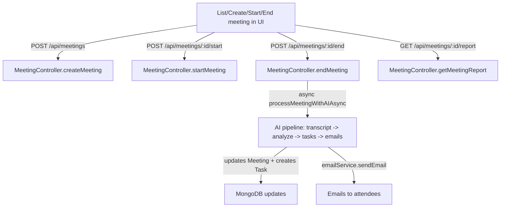
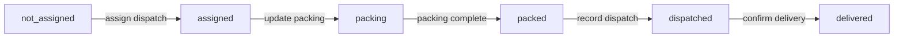

# EmployeeHR Repository Understanding

This document explains how the application works end-to-end (frontend -> backend APIs -> MongoDB), with deep dives into:

- Meetings (including AI processing and WebRTC signaling)
- Stock dispatch / invoices workflow

Where helpful, it also calls out mismatches between frontend API client code and backend route handlers.

## 1) High-level Architecture

### Frontend (Next.js / React)

- Routing uses the Next.js `app/` directory.
- Many pages are client components (`'use client'`) that call the backend with either:
  - the centralized API client at `lib/api.ts` (for HR/meetings endpoints), or
  - direct `fetch()` calls for the stock module (`/api/stock/...`) and other areas.

Key shared frontend glue:

- `lib/auth.ts`: stores token + user in `localStorage` and provides `logout()` and role helpers.
- `lib/apiBase.ts`: chooses `API_URL` (local vs production) based on environment/hostname.
- `lib/api.ts`: centralized HTTP wrapper that attaches the `Authorization: Bearer <token>` header and provides typed API methods.

### Backend (Express / Node.js)

- Backend entrypoint: `server/src/index.ts`
- MongoDB connection: `server/src/config/database.ts` (invoked from `index.ts`)
- Express middleware chain includes:
  - CORS
  - JSON body parsing
  - input sanitization (`server/src/middleware/sanitization.middleware.ts`)
  - rate limiting (`server/src/middleware/rateLimit.middleware.ts`)
  - route-level middleware: JWT auth + org/tenant isolation (`server/src/middleware/auth.ts`, `server/src/middleware/tenantIsolation.middleware.ts`)

### Database (MongoDB / Mongoose)

- Tenancy is enforced by scoping queries with `org_id` (tenant identifier) that is taken from the JWT payload.
- Each major entity has an `org_id` field (for example: `Meeting`, `Task`, `StockInvoice`, `StockProduct`, etc.).

## 2) Multi-Tenant Auth + Tenant Isolation

### JWT payload shape

- Backend token verify: `server/src/config/auth.ts`
  - `generateToken(payload)` and `verifyToken(token)` produce/validate the JWT.
- Auth middleware:
  - `server/src/middleware/auth.ts` verifies the `Authorization: Bearer ...` header
  - it sets `req.user = decoded` and (critically) `req.org_id = decoded.org_id`.

### Tenant isolation middleware

- `server/src/middleware/tenantIsolation.middleware.ts`
  - reinforces `req.org_id` from the decoded user token
  - logs an audit event via `AuditService.log(...)`.

### Route mounting / middleware ordering

Backend bootstrap mounts routes as:

- Public endpoints first (no JWT required) in `server/src/index.ts`
  - e.g. meeting guest access by `meeting_id`:
    - `GET /api/meetings/by-meeting-id/:meetingId`
    - `POST /api/meetings/by-meeting-id/:meetingId/join`
- Then all API modules under `/api/...`:
  - `app.use("/api/auth", authRoutes)`
  - `app.use("/api/users", userRoutes)`
  - ...and others.

Most route modules use:

- `router.use(authMiddleware, orgMiddleware, tenantIsolation)`

so that controllers can rely on `req.user` and `req.org_id`.

## 3) Frontend Request Flow (Token -> API calls)

### Token storage & request headers

- `lib/auth.ts`
  - `setToken(token)`: stores JWT under `localStorage` key `elevate_auth_token`
  - `getToken()`: retrieves token from `localStorage`
  - `logout()`: clears token + user and redirects to `/auth/login`
- `lib/api.ts`
  - `ApiClient.request()` reads `getToken()`
  - attaches `Authorization: Bearer ${token}` when present
  - on `401`:
    - if the request is not to an auth endpoint, it logs out and throws an error

### Base URL selection

- `lib/apiBase.ts` uses `NEXT_PUBLIC_API_URL` when present, otherwise:
  - local hostnames -> `http://localhost:5010`
  - production hostnames -> `https://hrapi.codewithseth.co.ke`

### Stock module uses direct fetch

The stock pages do not use `lib/api.ts`. Instead they directly call:

- `/api/stock/...` (dispatch, invoices, couriers, etc.)

using `API_URL` from `lib/apiBase.ts` and `getToken()` from `lib/auth.ts`.

## 4) Backend Request Pipeline (Cross-cutting)

In `server/src/index.ts`, the request pipeline includes:

- `helmet()` and `morgan("combined")`
- CORS policy allowing local + known production origins
- `express.json({ limit: "10mb" })` and `express.urlencoded(...)`
- input sanitization middleware:
  - `sanitizeInput` runs `sanitizeText()` over string fields in `req.body`
- rate limiting:
  - `apiLimiter` set to 100 requests/minute per client
- error handling:
  - `server/src/middleware/errorHandler.ts` formats JSON errors

Additionally:

- file uploads use `multer` middleware (only on routes that explicitly include it)
  - example: company branding logo uses `uploadLogo.single("logo")`
  - example: job application files use `uploadApplicationFiles.any()`

## 5) API Endpoint Catalog (from `lib/api.ts`)

This section lists the HTTP calls made by the centralized frontend API client (`lib/api.ts`) and maps each to the backend route module and primary controllers/models.

Note: this frontend API client contains some paths that do not perfectly match the backend routes (especially around `meetingsApi.update` and `meetingsApi.processWithAI` audio uploads). Those are marked as "MISMATCH".

### 5.1 Auth (`lib/api.ts` -> `/api/auth/*`)

1. `POST /api/auth/login` (`authApi.login`)
   - Backend: `server/src/routes/auth.routes.ts`
   - Controller: `AuthController.login`
   - Main models: `User`, `Company` (used by `AuthService`)

2. `POST /api/auth/register-company` (`authApi.registerCompany`)
   - Backend: `server/src/routes/auth.routes.ts`
   - Controller: `AuthController.registerCompany`
   - Main models: `Company`, `User` (created during onboarding)

3. `POST /api/auth/change-password` (`authApi.changePassword`)
   - Backend: `server/src/routes/auth.routes.ts`
   - Controller: `AuthController.changePassword`
   - Main models: `User`

### 5.2 Users (`lib/api.ts` -> `/api/users/*`)

- `GET /api/users`
  - Route: `server/src/routes/user.routes.ts`
  - Controller: `UserController.getAllUsers`
  - Main models: `User` (via `UserService`)

- `GET /api/users/:userId`
  - Route: `server/src/routes/user.routes.ts`
  - Controller: `UserController.getUserById`
  - Main models: `User` (via `UserService`)

- `POST /api/users`
  - Route: `server/src/routes/user.routes.ts`
  - Controller: **Note**: route file attaches `UserController.createEmployee` at `POST /` with `roleMiddleware("company_admin","hr")`.
  - Main models: `User` (via `AuthService.createEmployee`)

- `PUT /api/users/:userId`
  - Route: `server/src/routes/user.routes.ts`
  - Controller: `UserController.updateUser`
  - Main models: `User` (via `UserService.updateUser`)

- `DELETE /api/users/:userId`
  - `lib/api.ts` references this endpoint, but `user.routes.ts` (as currently present) does not expose `DELETE`.
  - This should be treated as a potential mismatch.

- `GET /api/users/team/:managerId`
  - Route: `server/src/routes/user.routes.ts`
  - Controller: `UserController.getTeamMembers`
  - Main models: `User` (via `UserService.getTeamMembers`)

### 5.3 Awards (`/api/awards/*`)

- `GET /api/awards` -> `server/src/routes/award.routes.ts` -> `AwardController.getAwards`
  - Main models: `Award`, `AwardNomination`

- `POST /api/awards` -> `roleMiddleware("company_admin","hr")` -> `AwardController.createAward`
  - Main models: `Award`

- `GET /api/awards/leaderboard/top` -> `AwardController.getLeaderboard`
  - Main models: `AwardNomination`

### 5.4 KPIs (`/api/kpis/*`)

- `GET /api/kpis` -> `KPIController.getAllKPIs` (main model: `KPI`)
- `GET /api/kpis/:kpiId` -> `KPIController.getKPIById` (main model: `KPI`)
- `POST /api/kpis` -> `roleMiddleware("company_admin","hr")` -> `KPIController.createKPI`
- `PUT /api/kpis/:kpiId` -> `roleMiddleware(...)` -> `KPIController.updateKPI`
- `DELETE /api/kpis/:kpiId` -> `KPIController.deleteKPI`

### 5.5 Performance (`/api/performance/*`)

- `GET /api/performance` is implemented as `GET /api/performance/?period=...` in `performance.routes.ts`:
  - route: `router.get("/", PerformanceController.getOrganizationPerformances)`
  - main model: `Performance` (and `PerformanceService`)

- `PUT /api/performance/...` and `create` paths in `lib/api.ts`:
  - `lib/api.ts` includes `create` and `update` for `/api/performance` and `/api/performance/:id`
  - backend route file `performance.routes.ts` currently exposes:
    - `GET /:userId/:period`
    - `PUT /:performanceId/kpi/:kpiId`
    - `GET /`
  - treat `create` / some `update` calls in `lib/api.ts` as potentially outdated or unused.

### 5.6 Feedback (`/api/feedback/*`)

- `GET /api/feedback` is referenced by `lib/api.ts`, but `feedback.routes.ts` currently exposes:
  - `GET /:userId`
  - `POST /`
  - `GET /:userId/summary`
  - so a mismatch is likely unless the frontend uses a different method/endpoint elsewhere.

### 5.7 PDPs (`/api/pdps/*`)

- Route module: `server/src/routes/pdp.routes.ts`
- Controllers: `PDPController.*`
- Main model: `PDP`

`lib/api.ts` uses:
- `GET /api/pdps` -> `PDPController.getPDPs`
- `GET /api/pdps/:id` -> `PDPController.getPDPById`
- `POST /api/pdps` -> `PDPController.createPDP`
- `PUT /api/pdps/:id` -> `PDPController.updatePDP`
- `DELETE /api/pdps/:id` -> `lib/api.ts` references it, but `pdp.routes.ts` has no `DELETE`.
  - Treat as mismatch unless there is a separate implementation.

### 5.8 Attendance (`/api/attendance/*`)

- Route module: `server/src/routes/attendance.routes.ts`
- Main model: `Attendance`

Backend exposes:
- `GET /:userId` -> `AttendanceController.getAttendanceRecords`
- `POST /` (role-protected) -> `AttendanceController.markAttendance`

### 5.9 Invitations (`/api/invitations/*`)

- Route module: `server/src/routes/invitation.routes.ts`
- Backend `InvitationController` uses `Company`, `User`, and `Invitation`

`lib/api.ts` uses:
- `POST /api/invitations/send` -> `InvitationController.sendInvitations` (role: company_admin, hr)
- `POST /api/invitations/accept` -> `InvitationController.acceptInvitation` (public)
- `GET /api/invitations/pending` -> `InvitationController.getPendingInvitations`
- `POST /api/invitations/resend` -> `InvitationController.resendInvitation`

### 5.10 Reports (`/api/reports/*`)

- Route module: `server/src/routes/report.routes.ts`
- Controller: `ReportController`
- Main models: `Report`, plus population from `User`

`lib/api.ts` calls:
- `POST /api/reports/save` -> `saveReport`
- `POST /api/reports/submit` -> `submitReport`
- `GET /api/reports/my-reports` -> `getUserReports`
- `GET /api/reports/:report_id` -> `getReport`
- `DELETE /api/reports/:report_id` -> `deleteReport`
- Admin:
  - `GET /api/reports/admin/all`
  - `POST /api/reports/admin/approve`
  - `POST /api/reports/admin/reject`
  - `GET /api/reports/admin/analytics`
- `POST /api/reports/generate-summary` -> `generateSummary`

### 5.11 Company / Branding / Email Config (`/api/company/*`, `/api/company/email-config/*`)

- Route module: `server/src/routes/company.routes.ts`
- Branding logo upload uses:
  - `uploadLogo.single("logo")` from `server/src/middleware/upload.middleware.ts`
- Controllers:
  - `CompanyController.getBranding`, `CompanyController.updateBranding`, `CompanyController.getPageAccessSettings`, ...
  - `CompanyEmailController.getEmailConfig`, `updateEmailConfig`, `verifyEmailConfig`, `disableEmailConfig`
- Main models: `Company`

### 5.12 Holidays (`/api/holidays/*`)

- Route: `server/src/routes/holiday.routes.ts`
- Controller: `HolidayController`
- Main models:
  - `Company` (for `countryCode`)
  - plus holiday storage via `HolidayService` (not shown in this doc)

### 5.13 Leave (`/api/leave/*`)

- Route: `server/src/routes/leave.routes.ts`
- Controller: `LeaveController`
- Main models:
  - `LeaveRequest`, `LeaveBalance`, `User`

### 5.14 Payroll (`/api/payroll/*`)

- Route: `server/src/routes/payroll.routes.ts`
- Controller: `PayrollController`
- Main models: `Payroll`, `User`, `Company`

### 5.15 Meetings (`/api/meetings/*`)

- Route: `server/src/routes/meeting.routes.ts` (auth-protected)
- Controller: `MeetingController`
- Main models: `Meeting`, `Task`, `User`

Endpoints exposed by the backend meeting router:

- `POST /api/meetings` -> `MeetingController.createMeeting`
- `GET /api/meetings` -> `MeetingController.getMeetings`
- `GET /api/meetings/:id` -> `MeetingController.getMeetingById`
- `POST /api/meetings/:id/join` -> `joinMeeting`
- `POST /api/meetings/:id/leave` -> `leaveMeeting`
- `PUT /api/meetings/:id/status` -> `updateMeetingStatus`
- `POST /api/meetings/:id/start` -> `startMeeting`
- `POST /api/meetings/:id/end` -> `endMeeting`
- `POST /api/meetings/:id/process-ai` -> `processWithAI`
- `GET /api/meetings/:id/report` -> `getMeetingReport`
- `POST /api/meetings/:id/transcript` -> `uploadTranscript`
- `DELETE /api/meetings/:id` -> `deleteMeeting`

Public guest access endpoints are mounted directly in `server/src/index.ts`:

- `GET /api/meetings/by-meeting-id/:meetingId`
- `POST /api/meetings/by-meeting-id/:meetingId/join`

MISMATCH notes:

- `lib/api.ts` `meetingsApi.update(id, data)` uses `PUT /api/meetings/:id`, but backend exposes `PUT /api/meetings/:id/status`.
- `lib/api.ts` `meetingsApi.processWithAI` sends audio as `FormData` under key `audio`, but `MeetingController.processWithAI` expects `audioUrl` and/or `transcript` in `req.body`.
- The meeting WebRTC UI also does not appear to implement live transcript generation (transcript state exists but is not populated).

### 5.16 Setup (`/api/setup/*`)

- Route: `server/src/routes/setup.routes.ts`
- Controller: `SetupController`
- Main model: `Company` (and counts from `User`, `KPI`)

`lib/api.ts` uses:
- `GET /api/setup/progress`
- `POST /api/setup/step`
- `POST /api/setup/complete`
- `POST /api/setup/skip`
- `POST /api/setup/reset`

### 5.17 Stamps (`/api/stamps/*`)

- Route: `server/src/routes/stamp.routes.ts`
- Controller: `StampController`
- Main model: `Stamp`

`lib/api.ts` maps directly to:
- CRUD endpoints at `/api/stamps` and `/api/stamps/:stampId`
- preview and SVG generation:
  - `POST /api/stamps/preview`
  - `GET /api/stamps/:stampId/svg`

## 6) Meetings Module Deep Dive

This section follows the most important paths users take:

1. Employee schedules/joins meetings and views reports
2. Meeting detail page supports guest join and WebRTC interactions
3. Ending a meeting triggers AI processing that:
   - produces summary + key points + action items
   - creates `Task` documents for action items
   - sends a summary email to attendees

### 6.1 UI entrypoints

1. Meetings list (authenticated UI)
   - `app/employee/meetings/page.tsx`
   - loads meetings via `meetingsApi.getAll()`
   - switches views between:
     - list
     - in-meeting interface (non-webrtc)
     - report view (reads `selectedMeeting.ai_*` fields)

2. Meeting detail (guest + WebRTC UI)
   - `app/meeting/[meetingId]/page.tsx`
   - `meetingId` is the `meeting_id` (not Mongo `_id`)
   - loads data using:
     - `GET /api/meetings/by-meeting-id/:meetingId` (authenticated or public)
   - uses `components/meetings/meeting-interface-webrtc.tsx` for the call UI

### 6.2 Meeting scheduling and joining (authenticated)

From the meetings list:

- `MeetingList` creates meetings by calling:
  - frontend -> `meetingsApi.create()` -> `POST /api/meetings`
  - backend -> `MeetingController.createMeeting`
    - generates a `meeting_id` and `meeting_link`
    - stores meeting document in Mongo (`Meeting` model)
    - optionally sends invite emails to attendee users (`emailService.sendEmail`)

Starting / ending:

- `components/meetings/meeting-interface.tsx` calls provided callbacks:
  - `onStartMeeting(meeting._id)` -> frontend -> `POST /api/meetings/:id/start` -> `MeetingController.startMeeting`
  - `onEndMeeting(meeting._id, transcript)` -> frontend -> `POST /api/meetings/:id/end` -> `MeetingController.endMeeting`

Backend `MeetingController.endMeeting`:
  - updates `status` to `completed`
  - sets `actual_end_time`
  - triggers AI processing asynchronously via `processMeetingWithAIAsync(...)`

### 6.3 Public/guest join flow (meeting links)

In `app/meeting/[meetingId]/page.tsx`:

- guests call backend without JWT to fetch meeting details:
  - `GET /api/meetings/by-meeting-id/:meetingId`
  - if meeting requires password, backend enforces it
- guests can join using:
  - `POST /api/meetings/by-meeting-id/:meetingId/join`
  - backend `MeetingController.joinMeetingByMeetingIdPublic`:
    - either finds existing attendee by `guest_id` or adds a new attendee record

### 6.4 AI Processing Pipeline (summary -> tasks -> emails)

Backend AI entrypoint:

- `MeetingController.processWithAI` (mounted at `POST /api/meetings/:id/process-ai`)
  - sets:
    - `meeting.ai_processing_status = "processing"`
    - `meeting.status = "in-progress"`
  - starts async pipeline:
    - `processMeetingWithAIAsync(meetingId, org_id, audioUrl, transcript, organizerId)`

Async steps inside `processMeetingWithAIAsync` (in `server/src/controllers/meetingController.ts`):

1. Transcript acquisition
   - If `audioUrl` is provided and `transcript` is missing:
     - `aiMeetingService.transcribeAudio(audioUrl)`
   - Otherwise uses `transcript` passed in from the request body.

2. AI analysis
   - `aiMeetingService.analyzeMeeting(finalTranscript, attendeeEmails)`
   - `AIMeetingService` uses OpenAI:
     - Whisper for transcription (optional)
     - `gpt-4o` chat completion with `response_format: { type: "json_object" }`
   - expects JSON with:
     - `summary`
     - `keyPoints`
     - `actionItems` (each has `description`, `assigned_to`, optional `due_date`, optional `priority`)
     - `sentiment`
     - `topics`

3. Persist AI results to meeting doc
   - updates meeting fields:
     - `ai_summary`
     - `key_points`
     - `action_items` (stored as objects with `description`, `assigned_to`, `due_date`, `task_id`)
   - sets:
     - `ai_processed = true`
     - `ai_processing_status = "completed"`
     - `status = "completed"`

4. Create tasks for action items
   - `aiMeetingService.createTasksFromActionItems(...)`
   - for each action item:
     - finds `User` by email (`email: item.assigned_to, org_id`)
     - creates `Task` with fields:
       - `org_id`
       - `title` = `item.description`
       - `description` = `Action item from meeting: ...`
       - `assigned_to` = user `_id`
       - `assigned_by` = organizer id
       - `priority`, `due_date` defaults, and AI flags (`is_ai_generated`, `is_ai_reminder`, `ai_source`)
   - returns created task IDs and writes `task_id` back into meeting `action_items` by index.

5. Send attendee summary email
   - `aiMeetingService.sendMeetingReportsToAttendees(...)`
   - generates attendee-specific HTML and calls `emailService.sendEmail(...)`.

Important implementation gaps / risks:

- `AIMeetingService.generateAttendeeEmailBody(...)` currently filters action items with:
  - `item.assigned_to === "your_email"`
  This is almost certainly a placeholder bug; as a result, the email may not include correctly assigned action items for each attendee.
- WebRTC UI transcript:
  - `components/meetings/meeting-interface-webrtc.tsx` defines `transcript` state, but it does not appear to be populated by SpeechRecognition (no `SpeechRecognition` usage found).
  - As a result, if end-meeting passes an empty transcript, AI analysis may fail.

### 6.5 WebRTC signaling (socket.io)

The WebRTC call UI uses:

- `components/meetings/meeting-interface-webrtc.tsx`
  - relies on `hooks/use-webrtc.ts`
- signaling server:
  - `server/src/services/webrtcSignaling.ts`

WebRTC signaling flow:

```mermaid
flowchart LR
  UIJoin[UI joins meeting] -->|socket.emit('join-meeting')| JoinServer[WebRTCSignalingService.on join-meeting]
  JoinServer -->|socket.emit existing participants| UIOffer[Hook creates peer connections + offers]
  UIOffer -->|socket.emit('offer')| SignalingForward[Signaling forwards offer]
  SignalingForward -->|socket.emit 'answer' / 'ice-candidate'| PeerConnect[WebRTC peer connections established]
  PeerConnect --> Chat[chat/reactions/raised-hand events forwarded]
```

Events supported by the backend signaling service:

- `join-meeting`
- `offer`, `answer`, `ice-candidate`
- `raise-hand` -> `raise-hand-updated`
- `meeting-reaction`
- `meeting-chat`
- participant disconnect handling

### 6.6 Mermaids: end-to-end meeting lifecycle



## 7) Stock Dispatch / Invoices Module Deep Dive

The stock dispatch workflow is built around `StockInvoice.dispatch` state stored inside the `StockInvoice` document.

### 7.1 UI entrypoints

1. Dispatch management queue (admin view)
   - `app/admin/stock/dispatch/page.tsx`
   - Loads:
     - `GET /api/stock/invoices` (invoice list)
     - `GET /api/stock/dispatch/analytics` (counts + packing progress stats)
   - Links each invoice to the detailed dispatch form:
     - `/admin/stock/dispatch/:invoiceId`

2. Dispatch detailed form
   - `app/admin/stock/dispatch/[invoiceId]/page.tsx`
   - Renders:
     - `components/stock/dispatch-workflow.tsx`

3. Invoices list and dispatch assignment (admin view)
   - `app/admin/stock/invoices/page.tsx`
   - Loads:
     - `GET /api/stock/invoices`
     - `GET /api/company/branding` (for PDF branding)
     - `GET /api/users` (dispatch user dropdown)
   - Assign dispatch user:
     - `POST /api/stock/invoices/:invoiceId/dispatch/assign`

### 7.2 Backend dispatch endpoints and state transitions

Stock routes:

- `server/src/routes/stock.routes.ts`
- Controller:
  - `server/src/controllers/stockController.ts`
- Core model:
  - `server/src/models/StockInvoice.ts`
- Related models:
  - `StockCourier`, `StockProduct`, `StockQuotation` (and `StockEntry`, `StockSale` for other stock activities)

Dispatch endpoints used by the dispatch workflow:

1. Load invoice + existing dispatch data:
   - `GET /api/stock/invoices/:invoiceId` -> `StockController.getInvoiceById`

2. Load couriers:
   - `GET /api/stock/couriers` -> `StockController.getCouriers`

3. Packing step:
   - `PUT /api/stock/invoices/:invoiceId/dispatch/packing`
   - Controller: `StockController.updateDispatchPacking`
   - Computes whether packing is complete via `computePackingCompletion(...)`
   - Updates:
     - `dispatch.status` to `packing` or `packed`
     - `dispatch.packingItems` and `dispatch.packingCompleted`

4. Record dispatch (transport + courier) step:
   - `POST /api/stock/invoices/:invoiceId/dispatch/dispatch`
   - Controller: `StockController.markInvoiceDispatched`
   - Validates:
     - packing completion (`computePackingCompletion` must be true)
     - `transportMeans` is present
     - courier information is either:
       - existing `courierId`, or
       - new courier fields (`courierName`, `courierContactName`, `courierContactNumber`)
   - Updates:
     - `dispatch.status = "dispatched"`
     - `dispatch.dispatchedAt`, `dispatch.dispatchedByUserId`
     - `dispatch.transportMeans`
     - `dispatch.courier` object

5. Log dispatch inquiry (call):
   - `POST /api/stock/invoices/:invoiceId/dispatch/inquiry`
   - Controller: `StockController.addDispatchInquiry`
   - Adds an entry into:
     - `dispatch.inquiries[]` with:
       - `mode` in `{ client, courier }`
       - method fixed to `"call"`

6. Confirm delivery:
   - `POST /api/stock/invoices/:invoiceId/dispatch/delivery`
   - Controller: `StockController.confirmInvoiceDelivery`
   - Validates:
     - invoice must already be `dispatch.status === "dispatched"`
     - condition must be `"good"` or `"not_good"`
   - Updates:
     - `dispatch.status = "delivered"`
     - sets `dispatch.delivery` details, including:
       - `arrivalTime`, `condition`, `everythingPacked`, `confirmedBy`, `confirmedAt`

7. Assign dispatch queue owner:
   - `POST /api/stock/invoices/:invoiceId/dispatch/assign`
   - Controller: `StockController.assignInvoiceToDispatch`
   - Admin-only action (checks `isAdminRole`)
   - Updates:
     - `dispatch.status = "assigned"`
     - `dispatch.assignedToUserId` and related metadata
     - initializes `dispatch.packingItems` from invoice items

### 7.3 Dispatch workflow state machine

Key `dispatch.status` values in `StockInvoice`:

- `not_assigned`
- `assigned`
- `packing`
- `packed`
- `dispatched`
- `delivered`

The UI uses these values to gate what steps are enabled.



### 7.4 How packing completion works

Backend helper in `StockController`:

- `computePackingCompletion(packingItems)`
  - returns true if every item has `packedQuantity >= requiredQuantity`

`updateDispatchPacking` uses this to set `dispatch.status` to:

- `packing` if not complete
- `packed` if complete

### 7.5 Analytics endpoint

- `GET /api/stock/dispatch/analytics` -> `StockController.getDispatchAnalytics`
- Returns:
  - counts per `dispatch.status`
  - `completionRate` based on delivered/total
  - `averagePackingProgress` based on packing ratios across invoices

### 7.6 Related stock entities (for context)

- `StockInvoice`
  - invoice metadata and the nested `dispatch` subdocument
- `StockQuotation`
  - invoices can be created by converting quotations (`convertQuotationToInvoice`)
- `StockProduct`
  - keeps `currentQuantity` and pricing
- `StockCourier`
  - used during dispatch recording
- `StockEntry` / `StockSale`
  - used for stock changes in other parts of the stock module

## 8) Cross-cutting Concerns + Notable Issues

### 8.1 Where sanitization happens

- `server/src/middleware/sanitization.middleware.ts` runs `sanitizeText` on string fields in `req.body`.

### 8.2 Where file uploads happen

- Company branding logo:
  - `server/src/routes/company.routes.ts`
  - uses `uploadLogo.single("logo")` with multer disk storage
  - saved under `server/uploads/logos/...`

- Job application files:
  - `server/src/routes/jobApplication.routes.ts`
  - uses `uploadApplicationFiles.any()`
  - saved under `server/uploads/applications/...`

### 8.3 Meetings: potential mismatch between frontend and backend audio processing

- Frontend `meetingsApi.processWithAI`:
  - if `audioFile` is provided, it sends `FormData` with key `audio`
- Backend `MeetingController.processWithAI`:
  - reads `audioUrl` and `transcript` from `req.body`
- Backend routes do not wire multer for `process-ai` in `server/src/routes/meeting.routes.ts`

Net effect:

- audio upload may not work as intended unless there is additional middleware elsewhere (not found in `meeting.routes.ts`).

### 8.4 Meetings: transcript generation appears incomplete in WebRTC UI

- `components/meetings/meeting-interface-webrtc.tsx` initializes `transcript` state
- A repo search did not find `SpeechRecognition` usage in that component
- Without a transcript, AI analysis may receive an empty string

### 8.5 Meetings: attendee action items in email likely filtered incorrectly

- `AIMeetingService.generateAttendeeEmailBody` filters action items with:
  - `item.assigned_to === "your_email"`
- This is likely a placeholder mismatch; action items may not render per-attendee in emails.

## 9) Glossary (Quick Reference)

- `org_id`: tenant identifier scoped in JWT payload and applied to all queries.
- `role`:
  - `company_admin`, `hr`, `manager`, `employee`
- `Meeting`:
  - scheduled meeting stored in Mongo with `meeting_id` (link id) and `_id` (Mongo document id).
- `Task`:
  - follow-up tasks created from AI action items, linked back to a meeting via `meeting_id` (string).
- Stock dispatch statuses:
  - `assigned`, `packing`, `packed`, `dispatched`, `delivered` etc. stored in `StockInvoice.dispatch.status`.

## Appendix: Where to Look Next

If you want a deeper “full repository” understanding beyond the two deep-dives above, the next highest-signal areas are:

- `app/**/page.tsx` for workflows (UI state + API calls)
- `server/src/controllers/*` for business logic
- `server/src/models/*` for entity shapes and tenant scoping rules
- any `server/src/services/*` used by controllers for external integrations (AI, email, holidays, compliance, etc.)